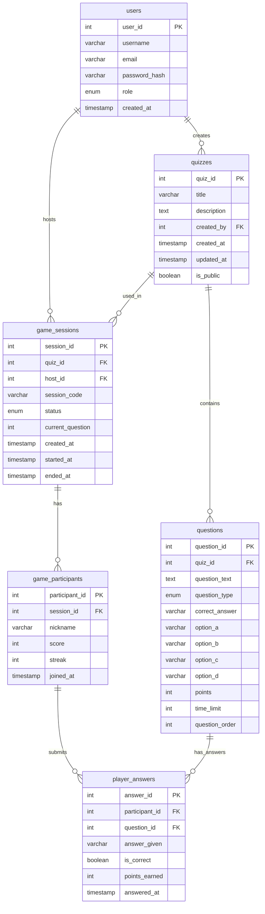

# Interactive Quiz Show Platform - Database Design

**Version:** 3.0
**Date:** February 2026
**Author:** Enov Wayoi

## Database Overview
The quiz platform database consists of 6 main entities that manage users, quizzes, questions, game sessions, and anonymous player participation. The design follows Third Normal Form (3NF) with clear, non-redundant relationships.

## Entity Relationship Diagram (ERD)

## Entity Descriptions and Business Rules

### 1. USERS
Stores all user accounts (hosts, players, admins).

**Business Rules:**
- Username must be unique across all users.
- Email must be unique and valid format.
- Passwords must be hashed using bcrypt before storage.
- Default role is 'player' unless specified.
- Users can be hosts and players simultaneously.

### 2. QUIZZES
Stores quiz metadata and information.

**Business Rules:**
- Each quiz must have a title.
- Quiz must be associated with a user (creator).
- When a user is deleted, their quizzes are also deleted (CASCADE).
- Quizzes are private by default.
- One user can create many quizzes.

### 3. QUESTIONS
Stores individual questions for each quiz.

**Business Rules:**
- Each question must belong to a quiz.
- When a quiz is deleted, all its questions are deleted (CASCADE).
- Multiple choice questions must have at least 2 options (option_a, option_b).
- True/false questions use only option_a (True) and option_b (False).
- Fill-in-blank questions don't use options.
- Points must be positive integer (typically 10).
- Time limit must be between 5 and 300 seconds.
- Questions are accessed through their parent quiz, not directly through game sessions.

### 4. GAME_SESSIONS
Stores active and completed game sessions.

**Business Rules:**
- Each session must have a unique join code.
- Session code is generated randomly (6 uppercase alphanumeric characters).
- Status progresses: `waiting` -> `active` -> `completed`.
- When quiz is deleted, associated sessions are deleted (CASCADE).
- When host user is deleted, their sessions are deleted (CASCADE).
- `current_question` tracks which question is being displayed (0 = lobby/waiting).
- Questions for a session are retrieved through: `game_sessions.quiz_id` -> `questions.quiz_id`.

### 5. GAME_PARTICIPANTS
Tracks anonymous players who joined a game session.

**Business Rules:**
- Links a player to a game session.
- Users join using a non-unique `nickname` instead of an account. 
- Score is cumulative of all points earned in the session.
- Tracks consecutive correct answers in the `streak` column for bonus point calculation.
- Updated in real-time as player answers questions.
- Cascade delete when session is deleted.
- No user login is required to generate a participant record.

### 6. PLAYER_ANSWERS
Stores individual answer submissions during games.

**Business Rules:**
- Each answer must be linked to a participant (which contains both session and user info).
- Each answer must be linked to a question.
- Points earned is 0 for incorrect answers.
- Points earned equals `question.points` for correct answers.
- Answer is evaluated immediately upon submission.
- Cascade delete when participant or question is deleted.
- **Design Note:** Uses `participant_id` instead of separate `session_id` and `player_id` for simpler joins.
    - To get session info: `player_answers` -> `game_participants` -> `game_sessions`

## Relationships

### One-to-Many Relationships

- **USERS -> QUIZZES (1:N)**
    - One user can create many quizzes.
    - Relationship: `quizzes.created_by` -> `users.user_id`
    - Delete: CASCADE

- **QUIZZES -> QUESTIONS (1:N)**
    - One quiz contains many questions.
    - Relationship: `questions.quiz_id` -> `quizzes.quiz_id`
    - Delete: CASCADE

- **USERS -> GAME_SESSIONS (1:N as host)**
    - One user (host) can create many game sessions.
    - Relationship: `game_sessions.host_id` -> `users.user_id`
    - Delete: CASCADE

- **QUIZZES -> GAME_SESSIONS (1:N)**
    - One quiz can be used in many game sessions.
    - Relationship: `game_sessions.quiz_id` -> `quizzes.quiz_id`
    - Delete: CASCADE

- **GAME_SESSIONS -> GAME_PARTICIPANTS (1:N)**
    - One game session can have many participants.
    - Relationship: `game_participants.session_id` -> `game_sessions.session_id`
    - Delete: CASCADE

- **GAME_PARTICIPANTS -> PLAYER_ANSWERS (1:N)**
    - One participant can submit many answers.
    - Relationship: `player_answers.participant_id` -> `game_participants.participant_id`
    - Delete: CASCADE

- **QUESTIONS -> PLAYER_ANSWERS (1:N)**
    - One question can receive many answers (from different participants).
    - Relationship: `player_answers.question_id` -> `questions.question_id`
    - Delete: CASCADE
