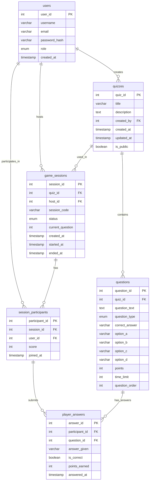

```mermaid
erDiagram
    users {
        int user_id PK
        varchar username
        varchar email
        varchar password_hash
        enum role
        timestamp created_at
    }
    quizzes {
        int quiz_id PK
        varchar title
        text description
        int created_by FK
        timestamp created_at
        timestamp updated_at
        boolean is_public
    }
    questions {
        int question_id PK
        int quiz_id FK
        text question_text
        enum question_type
        varchar correct_answer
        varchar option_a
        varchar option_b
        varchar option_c
        varchar option_d
        int points
        int time_limit
        int question_order
    }
    game_sessions {
        int session_id PK
        int quiz_id FK
        int host_id FK
        varchar session_code
        enum status
        int current_question
        timestamp created_at
        timestamp started_at
        timestamp ended_at
    }
    session_participants {
        int participant_id PK
        int session_id FK
        int user_id FK
        int score
        timestamp joined_at
    }
    player_answers {
        int answer_id PK
        int participant_id FK
        int question_id FK
        varchar answer_given
        boolean is_correct
        int points_earned
        timestamp answered_at
    }

    users ||--o{ quizzes : "creates"
    users ||--o{ game_sessions : "hosts"
    users ||--o{ session_participants : "participates_in"
    quizzes ||--o{ questions : "contains"
    quizzes ||--o{ game_sessions : "used_in"
    game_sessions ||--o{ session_participants : "has"
    session_participants ||--o{ player_answers : "submits"
    questions ||--o{ player_answers : "has_answers"
```
