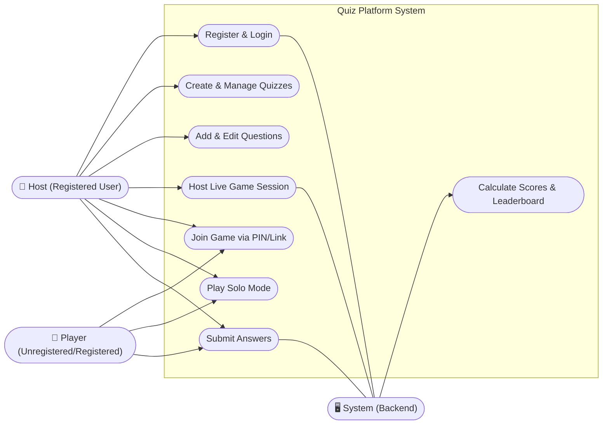
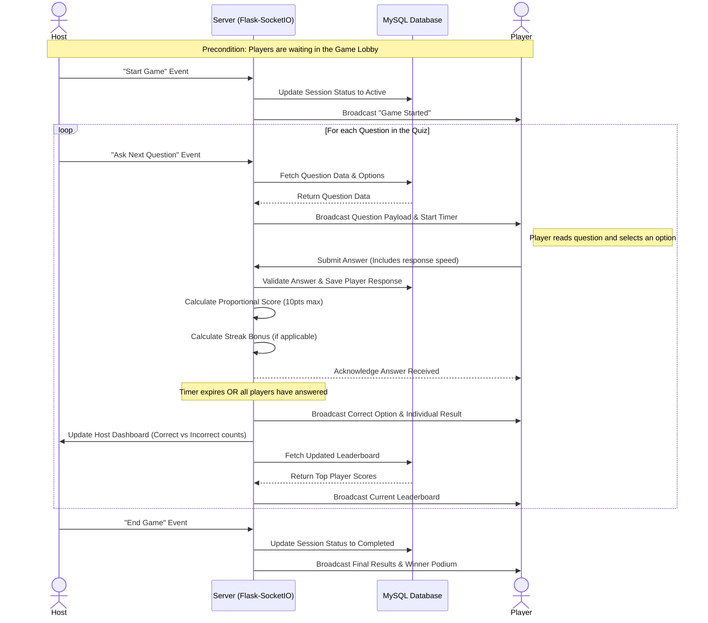

# Software Design Document (SDD) - UML Diagrams & Scenarios

## 1. UML Use Case Diagram

The following Use Case Diagram illustrates the primary interactions between the actors (Player, Host, and System) and the core features of the **Interactive Quiz Show Platform**.

---

## 2. Use Case Scenarios

Detailed textual descriptions for the most critical use cases in the platform.

### Use Case 1: Host a Live Game Session
* **Actor(s):** Host (Registered User), System
* **Preconditions:** The Host is logged in and has created at least one quiz containing one or more questions.
* **Main Success Scenario:**
  1. The Host navigates to their dashboard and selects a quiz to host.
  2. The Host clicks the "Host Game" button.
  3. The System generates a unique game session PIN and establishes a WebSocket lobby room.
  4. The System displays the lobby screen to the Host, showing the PIN and waiting participants.
  5. Players join the lobby using the PIN.
  6. Once satisfied with the participant list, the Host clicks "Start Game."
  7. The System activates the first question and broadcasts it to all connected players.
* **Alternative Scenario (Zero Questions):**
  1. If the selected quiz has no questions, the System prevents the Host from starting the game and displays an error message ("Quiz must have at least one question to be played").

### Use Case 2: Join a Game Session
* **Actor(s):** Player (Any User), System
* **Preconditions:** A Host has created an active game session, and the Player has the session PIN or an anonymous sharing link.
* **Main Success Scenario:**
  1. The Player navigates to the homepage or dashboard.
  2. The Player enters their desired nickname and the active session PIN into the "Join Game" form.
  3. The Player submits the form.
  4. The System validates the PIN and checks if the session is accepting players.
  5. The System adds the Player to the session's participant list and establishes a WebSocket connection.
  6. The Player is redirected to the waiting room/lobby screen until the Host starts the game.
* **Alternative Scenario (Invalid PIN):**
  1. The Player enters an incorrect or expired PIN.
  2. The System rejects the request and displays an error message ("Invalid PIN or Game Session not found").

### Use Case 3: Create and Manage a Quiz
* **Actor(s):** Host (Registered User), System
* **Preconditions:** The Host is securely logged into the platform.
* **Main Success Scenario:**
  1. The Host clicks the "Create Quiz" button on their dashboard.
  2. The Host provides a quiz title, description, and status (Public/Private), then submits the form.
  3. The System creates a new quiz record in the database, associating it with the Host's `user_id`.
  4. The System redirects the Host to the Quiz Details page.
  5. The Host clicks "Add Question" to begin populated the quiz with Multiple Choice, True/False, or Fill-in-the-Blank questions.
  6. The System saves each new question securely to the database.

---

## 3. UML Sequence Diagram

Sequence diagrams map out interactions over time. This sequence diagram details the real-time gameplay loop using Flask-SocketIO when a Host presents a question, Players answer, and the System calculates the scores.

